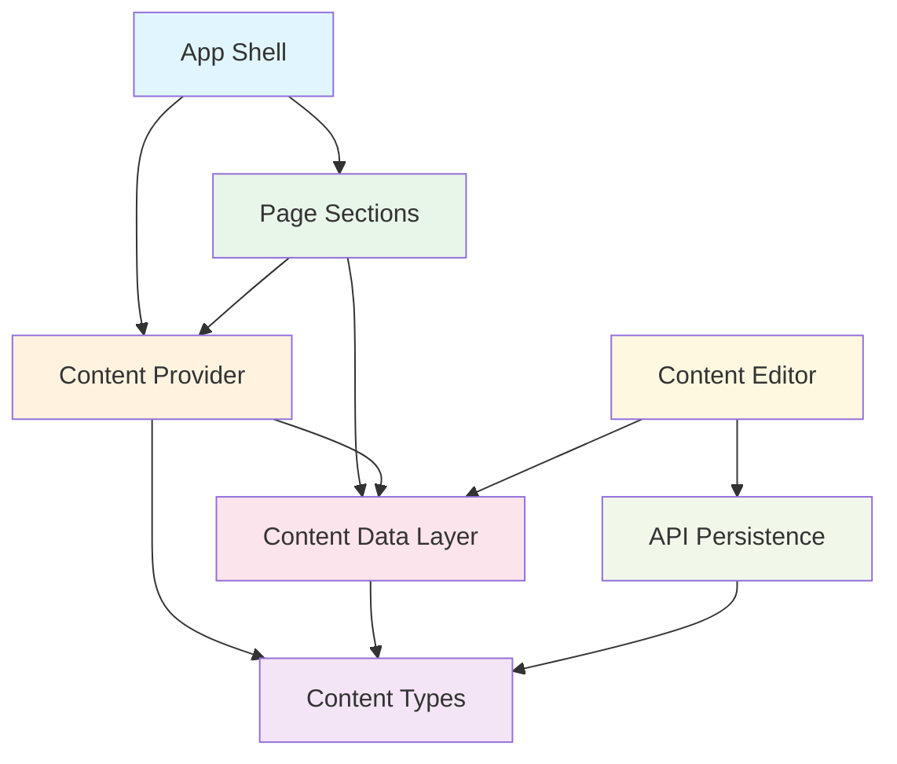
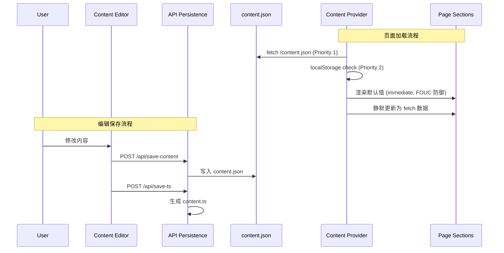

> generated_by: nexus-mapper v2
> verified_at: 2026-05-10
> provenance: AST-backed import edges; relative-path imports manually resolved to system-level dependencies

# 系统间依赖关系

## Mermaid 依赖图



## Mermaid 数据流时序图



## 依赖矩阵

| 源系统 ↓ / 目标系统 → | Content Data Layer | Content Provider | Content Types | Page Sections | Content Editor | API Persistence |
|------------------------|:------------------:|:----------------:|:-------------:|:-------------:|:--------------:|:---------------:|
| App Shell              |                    | ✓                |               | ✓             |                |                 |
| Page Sections          | ✓                  | ✓                |               |               |                |                 |
| Content Provider       | ✓                  |                  | ✓             |               |                |                 |
| Content Data Layer     |                    |                  | ✓             |               |                |                 |
| Content Editor         | ✓                  |                  |               |               |                | ✓               |
| API Persistence        |                    |                  | ✓             |               |                |                 |

## 关键依赖说明

### 双重 import 模式（Sections → ContentProvider + ContentDataLayer）

所有 section 组件同时依赖两个数据源：

```typescript
// Hero.tsx 典型模式
import { useContent } from '../ContentProvider';           // 运行时数据
import { heroContent as defaultHeroContent } from '../config/content';  // 默认值回退

const { hero } = useContent();
const heroData = hero || defaultHeroContent;  // FOUC 防御：立即渲染默认值
```

这不是循环依赖或架构违规，而是 FOUC（Flash of Unstyled Content）防御策略：ContentProvider 立即渲染 config/content 的默认值，后台静默从 content.json 更新。

### 编辑器→数据层→API 的单向流

```
Editor → config/content (读取 initialData)
Editor → /api/save-content (写入 content.json)
Editor → /api/save-ts (生成 content.ts)
```

编辑器是 content.json 高频变更（38次）的唯一驱动者，coupling_score 0.971 证实了 content.ts ↔ content.json 的强同步关系。
